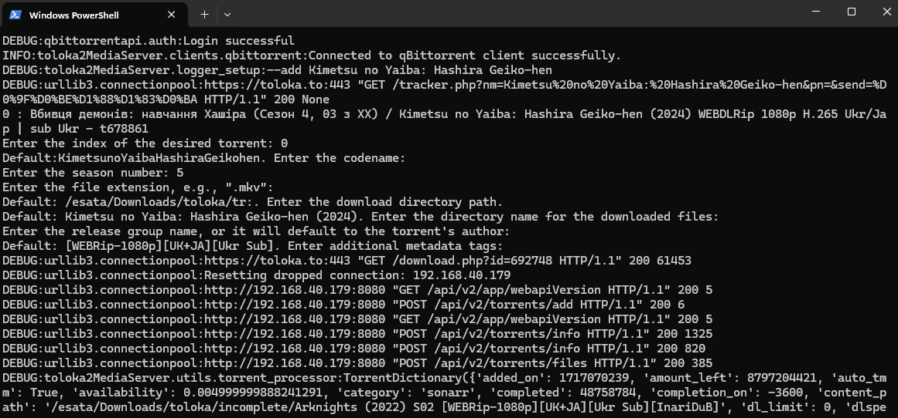
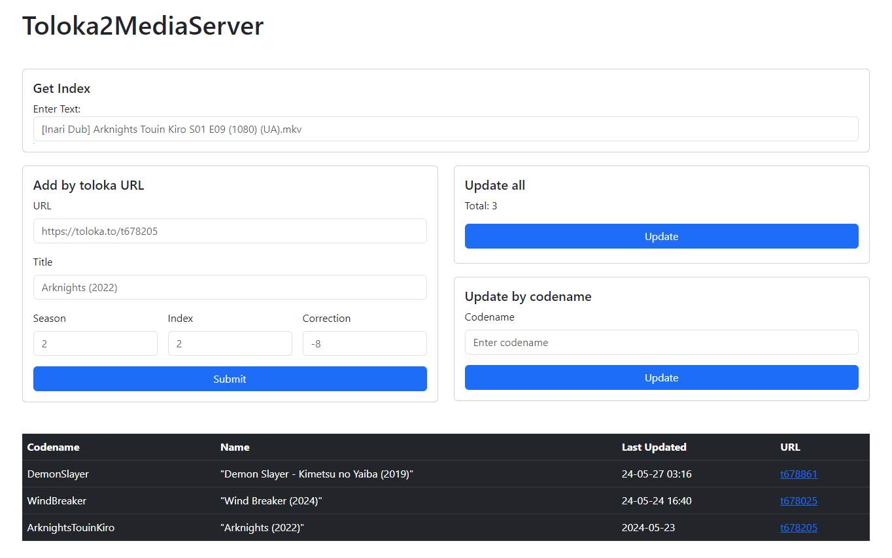
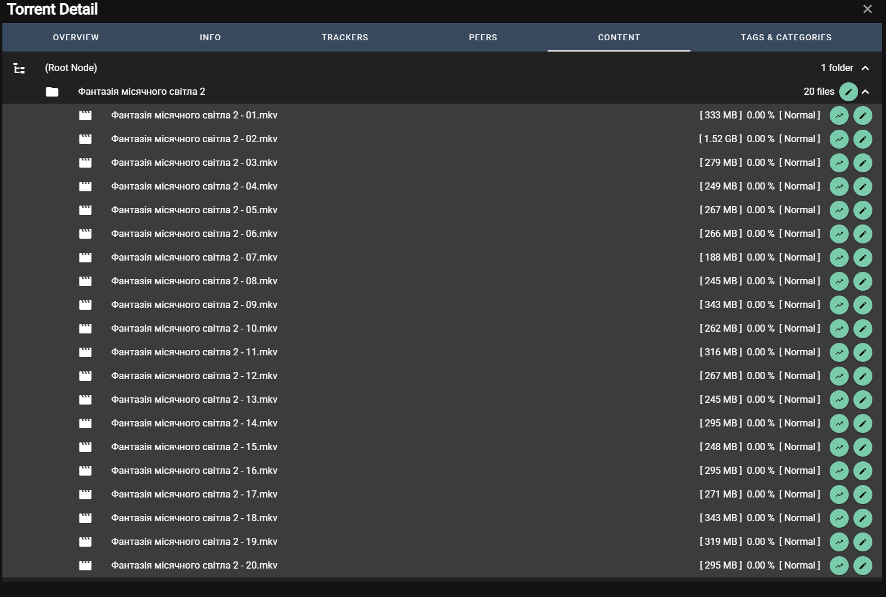
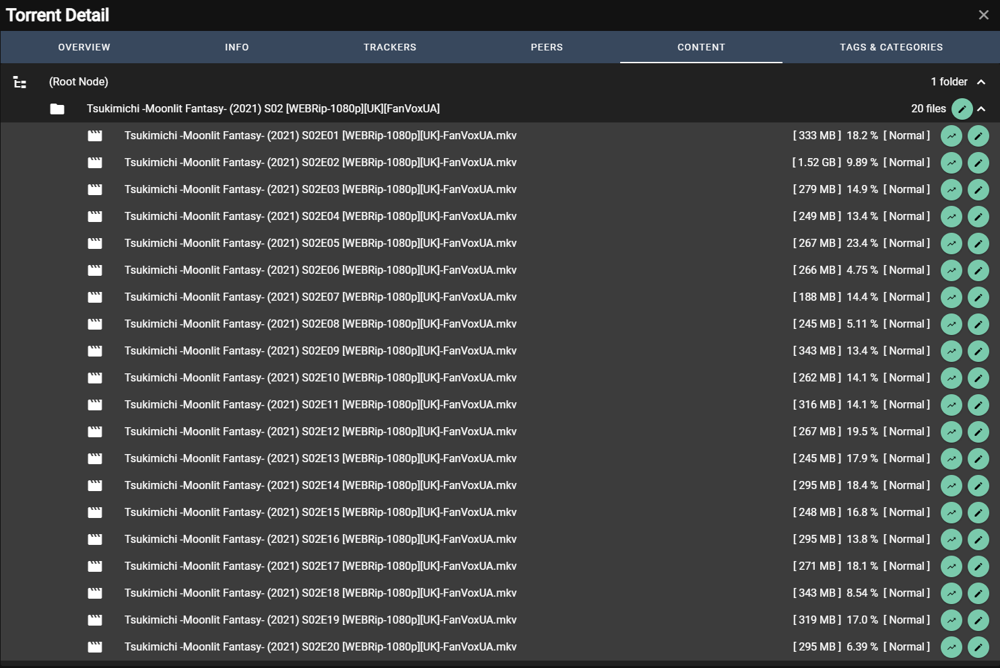
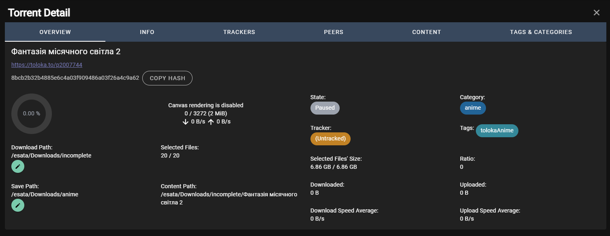

# Toloka2MediaServer [](https://opensource.org/licenses/)

<p align="center">


</p>

## English Section
The primary goal of this project is to address naming issues for Ukrainian localization studios that create regional naming conventions for shows/anime. Additionally, Toloka follows the rule that ongoing series/anime should be in a single release. As a result of these actions, none of the modern *arr suites or media servers are capable of parsing files and automating the download process effectively.

This project is specifically tailored to use the Toloka torrent tracker and a custom-made [toloka2python by CakesTwix](https://github.com/CakesTwix/toloka2python) library to establish connections, find torrents, and gather additional metadata. Adapting it to work with other trackers may require some effort on your part. Support for Jackett/Prowlarr is currently not planned as it would necessitate adjustments in their Toloka implementation.

The scripts in this project make direct API calls to the torrent clients like Transmission and qBittorrent to adjust the torrent name, folder name, and file name according to the following naming convention:
- Torrent/Folder: `SeriesName Season [Quality] [Language] [Subs] [ReleaseGroup]`
- File: `SeriesName SeasonEpisode [Quality] [Language] [Subs]-ReleaseGroup.extension`

Any future documentation will be provided in Ukrainian. Please use a translator if needed or create new issues if you require further assistance.

## UA Section
Консольна утиліта для докачування нових серій аніме з Toloka.
Для скачування торрент-файлів використовується власна бібліотека toloka2python!

> У мене на даний момент немає бажання писати під інші торрент-трекери або щось крім аніме. Я написав суто для себе і роздав вихідний код, щоб ви могли самостійно змінити код і поширювати його далі! Слався Open Source!

Чому я зробив цей скрипт? Хочу дивитися онгоінги і не думати над постійним перейменуванням для свого медіа-сервера Jellyfin, оскільки у кожного свій "стандарт" і тільки одиниці дотримуються стандарту "S01E01", який підтримує мій медіа-сервер.
Наразі можна качати торренти, де одна директорія (Один сезон), в якому знаходяться серії

```
The Girl I Like Forgot Her Glasses (S1)
├── Episode S1E01.mkv
├── Episode S1E02.mkv
├── Episode S1E03.mkv
├── Episode S1E04.mkv
├── Episode S1E05.mkv
├── Episode S1E06.mkv
├── Episode S1E07.mkv
└── Episode S1E08.mkv
```


## Огляд Інтерфейсу Користувача

### Інтерфейс Командного Рядка (CLI)

Застосунок надає інтерфейс командного рядка (CLI) для користувачів, які віддають перевагу безпосередньому взаємодії з програмним забезпеченням через їхній термінал. Нижче наведено приклад виконання звичайної команди та її виводу.

#### Приклад Команди

Ось як запустити приклад команди:

```bash
python -m toloka2MediaServer -a "Kimetsu no Yaiba: Hashira Geiko-hen"
```

#### Вивід

```
0 : Вбивця демонів: навчання Хашіра (Сезон 4, 03 з XX) / Kimetsu no Yaiba: Hashira Geiko-hen (2024) WEBDLRip 1080p H.265 Ukr/Jap | sub Ukr - t678861
Enter the index of the desired torrent: 0
Default:KimetsunoYaibaHashiraGeikohen. Enter the codename:
Enter the season number: 5
Enter the file extension, e.g., ".mkv":
Default: /esata/Downloads/toloka/tr:. Enter the download directory path.
Default: Kimetsu no Yaiba: Hashira Geiko-hen (2024). Enter the directory name for the downloaded files:
Enter the release group name, or it will default to the torrent's author:
Default: [WEBRip-1080p][UK+JA][Ukr Sub]. Enter additional metadata tags:
```

**Скріншот:**



### Веб-Інтерфейс Користувача (Web UI)

Для користувачів, які віддають перевагу графічному інтерфейсу, застосунок також включає веб-інтерфейс. Нижче наведено знімок екрану, який показує основний інтерфейс.

#### Головна Сторінка

Головна сторінка надає зручний інтерфейс для доступу до всіх функцій застосунку. 

**Скріншот:**



## Огляд работи

**Перед змінами:**  
 
**Після змін:**  


**Перед змінами:**  
 
**Після змін:**  


### Використання/Приклади
Цей блок містить приклади використання команд для `toloka2MediaServer`. Коментарі надають пояснення щодо деяких параметрів та їх використання.
* **Допомога**
	```bash
	python -m toloka2MediaServer --help
	```
* **Додати новий торрент вручну**
	```bash
	python -m toloka2MediaServer -a "Назва торрента роздачі"
	```
* **Додати новий торрент автоматично**
	```bash
	python -m toloka2MediaServer --add --url https://toloka.to/t675888 --season 02 --index 2 --correction 0 --title "Tsukimichi -Moonlit Fantasy-"
	```
* **Оновити всі торренти**
	```bash
	python -m toloka2MediaServer
	```
* **Завантажити нові серії, якщо торрент оновився**
	```bash
	python -m toloka2MediaServer -с CODENAME
	```
	> Коднейм береться з файлу titles.ini, про нього буде вказано пізніше
* **Отримати список чисел із рядка**
	```bash
	python -m toloka2MediaServer -n "text1 123"
	```
	> Це необхідно для перейменування файлів у торренті для визначення номера серії у Jellyfin або Plex. В конфігурації потрібно вказати, в якому індексі знаходиться номер серії.

> **Примітка:** У торренті береться відразу Директорія/Файл.mkv, наприклад:
Horimiya - Piece [WEBDL 1080p HEVC]/Horimiya - Piece - 01 (WEBDL 1080p HEVC AAC) Ukr DVO SUB.mkv

## Crontab (Every day at 8:00)
```bash
crontab -e
```
> 0 8 * * * cd /path/to/toloka2MediaServer/ && python3 -m toloka2MediaServer

## Розгортання за допомогою Docker

Дотримуйтесь цих кроків для розгортання `Toloka2MediaServer` за допомогою Docker:

### Передумови

Переконайтеся, що Docker встановлено на вашій системі. Ви можете завантажити його з [офіційного сайту Docker](https://www.docker.com/get-started).

### Клонування репозиторію

Спочатку клонуйте репозиторій на ваш локальний комп'ютер:

```bash
cd ~
git clone https://github.com/maksii/Toloka2MediaServer
cd Toloka2MediaServer
```

### Файли конфігурації

Перед побудовою образу Docker створіть і налаштуйте необхідні файли конфігурації:

```bash
mkdir -p /home/appconfig

# Створіть і відредагуйте файл app.ini
nano /home/appconfig/app.ini

# Створіть і відредагуйте файл titles.ini
nano /home/appconfig/titles.ini
```

Переконайтеся, що ви заповнили файли `app.ini` та `titles.ini` відповідно до вимог вашого додатку.

### Побудова образу Docker

Побудуйте образ Docker за допомогою наступної команди:

```bash
docker build -t toloka2mediaserver .
```

### Запуск контейнера Docker

Запустіть ваш контейнер Docker за допомогою наступної команди:

```bash
docker run -d -p 5000:5000 -v /home/appconfig:/app/toloka2MediaServer/data --name toloka toloka2mediaserver
```

Ця команда запустить контейнер у відокремленому режимі, відображатиме порт 5000 контейнера на порт 5000 на хості і приєднає створену вами директорію конфігурації `/home/appconfig` до `/app/toloka2MediaServer/data` всередині контейнера.

### Перевірка розгортання

Після запуску контейнера ви можете перевірити, що додаток працює, відвідавши:

```
http://localhost:5000
```

Замініть `localhost` на IP-адресу вашого сервера, якщо ви звертаєтесь з іншої машини.

## Розгортання за допомогою готового образу Docker

Цей розділ пояснює, як розгорнути `Toloka2MediaServer` використовуючи готовий образ з Docker Hub.

### Використання Docker

1. **Завантаження образу Docker**
   Завантажте готовий образ з Docker Hub за допомогою наступної команди:

   ```bash
   docker pull maksii/toloka2mediaserver:latest
   ```


2. **Запуск контейнера**
   Використовуйте наступну команду для запуску контейнера:

   ```bash
   docker run -d -p 5000:5000 -v /path/to/your/config:/app/toloka2MediaServer/data --name toloka maksii/toloka2mediaserver:latest
   ```

   Замініть `/path/to/your/config` на шлях до вашої папки конфігурації.

### Використання Portainer

Якщо ви використовуєте Portainer для управління контейнерами Docker, ви можете легко розгорнути `Toloka2MediaServer` як стек:

1. **Логін в Portainer**
   Увійдіть у вашу панель керування Portainer .

2. **Створення стека**
   Перейдіть до розділу "Stacks" і натисніть "Add Stack".

3. **Конфігурація стека**
   Дайте ім'я вашому стеку і вставте наступний YAML конфіг у поле "Web editor":

   ```yaml
   version: '3.8'
   services:
     toloka2mediaserver:
       image: maksii/toloka2mediaserver:latest
       ports:
         - "5000:5000"
       volumes:
         - /path/to/your/config:/app/toloka2MediaServer/data
       restart: unless-stopped
   ```

   Замініть `/path/to/your/config` на шлях до вашої папки конфігурації.

4. **Розгортання стека**
   Натисніть "Deploy the stack" для запуску вашого додатку.

## Configs

* ### app.ini
```ini
[Python]
# NOTSET
# DEBUG
# INFO
# WARNING
# ERROR
# CRITICAL
logging = INFO

[transmission]
username = Імя користувача
password = Пароль
port = 9091
host = localhost
protocol = http
rpc = /transmission/rpc
category = sonarr
tag = tolokaAnime

[qbittorrent]
username = Імя користувача
password = Пароль
port = 8080
host = 192.168.40.22
protocol = http
tag = toloka
category = sonarr

[Toloka]
username = 
password = 
client = qbittorrent
default_download_dir = /media/HDD/Jellyfin/Anime
default_meta = [WEBRip-1080p][UK+JA][Ukr Sub]
wait_time = 10
client_wait_time = 2
```
* ### titles.ini
```ini
[ArknightsTouin]
episode_index = 2
season_number = 02
ext_name = .mkv
torrent_name = "Arknights: Touin Kiro (2022)"
download_dir = /media/HDD/Jellyfin/Anime
publishdate = 24-05-23 21:32
release_group = InariDuB
meta = [WEBRip-1080p][UK+JA][Ukr Sub]
hash = 97e3023362ebb41263f3266ac3a72cc56eda0885
adjusted_episode_number = -8
guid = t678205

[Tsukimichi]
episode_index = 2
season_number = 02
ext_name = .mkv
torrent_name = "Tsukimichi -Moonlit Fantasy- (2021)"
download_dir = /media/HDD/Jellyfin/Anime
publishdate = 24-05-28 17:16
release_group = FanVoxUA
meta = [WEBRip-1080p][UK][Ukr Sub]
hash = 8bcb2b32b4885e6c4a03f909486a03f26a4c9a62
adjusted_episode_number = 0
guid = t675888
```
	
### Конфігурація епізодів аніме
<small>

| Властивість            | ArknightsTouin                                      | Tsukimichi                                     | Визначення                                                           |
|------------------------|-----------------------------------------------------|------------------------------------------------|----------------------------------------------------------------------|
| episode_index         | 2                                                   | 2                                              | Індекс, що вказує номер епізоду(звідки брати номер епізоду)                                      |
| season_number          | 02                                                  | 02                                             | Номер сезону                                            |
| ext_name               | .mkv                                                | .mkv                                           | Формат файлу                                                        |
| torrent_name           | "Arknights: Touin Kiro (2022)"                     | "Tsukimichi -Moonlit Fantasy- (2021)"          | Базове ім'я для генерації назви торрента, тек та файлів             |
| download_dir           |                                                     | /media/HDD/Jellyfin/Anime                      | Директорія для завантаження медіа (використовується в Transmission) |
| publishdate            | 2024-05-23                                          | 2024-05-21                                     | Системне значення для визначення оновлень торренту                   |
| release_group          | InariDuB                                            | FanVoxUA                                       | Реліз група або автор роздачі                                       |
| meta                   | [WEBRip-1080p][UK+JA][Ukr Sub]                     | [WEBRip-1080p][UK][Ukr Sub]                     | Додаткові метадані, які будуть додані у назву                         |
| hash                   | 97e...0885          | 12      | Системне значення - ID торрент файлу для майбутнього пошуку           |
| adjusted_episode_number | -8                                             | 0                                              | Коригування номера епізоду сезону для абсолютного або азіатського неймінгу |
| guid                   | t678205                                           | t675888                                      | Системне значення для ідентифікації конкретного аніме у списку        |

</small>

## Authors

- [@CakesTwix](https://www.github.com/CakesTwix)

<a href="https://www.buymeacoffee.com/cakestwix"></a>
</p>


## License

- [GPL-v3](https://choosealicense.com/licenses/gpl-3.0/)

